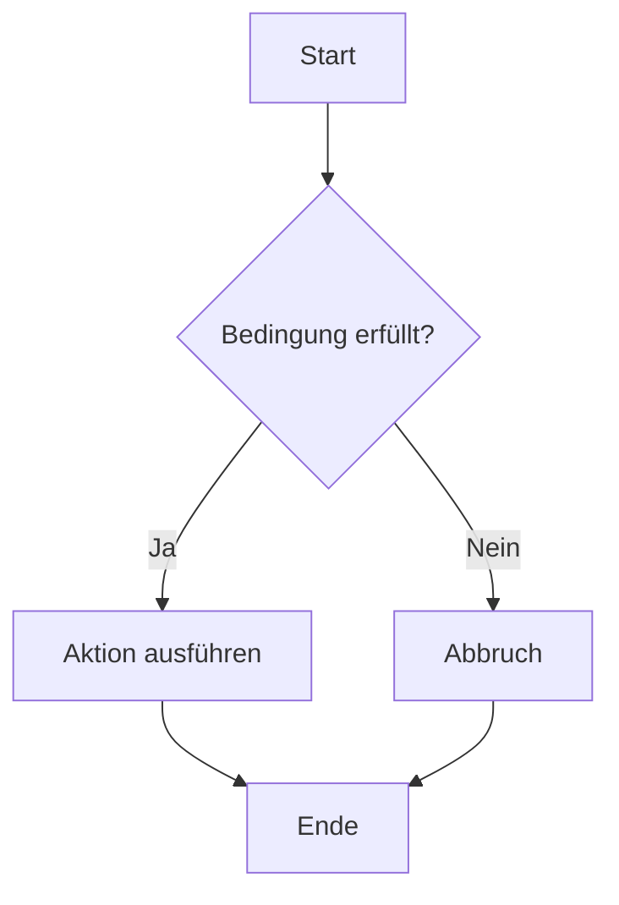

# GitHub Workshop

Lorem ipsum

[🐞 Bug Melden](https://github.com/GregorBiswanger/t803-hello-github/issues/new?template=bug_report.md&labels=feature&title=Fehler%20gefunden)

```javascript
console.log('Hello World');
```

```csharp
Console.WriteLine("Hello World");
```


